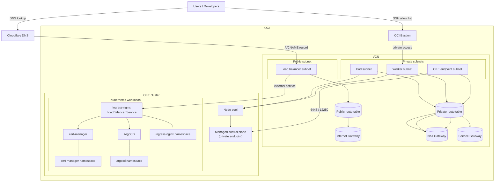

# Infrastructure Architecture Diagrams

## Runtime Infrastructure

## Notes

- The runtime diagram shows how OCI networking, OKE, Bastion, Kubernetes add-ons, and Cloudflare are actually connected.
- Use this diagram when explaining traffic flow or deployment behavior.
